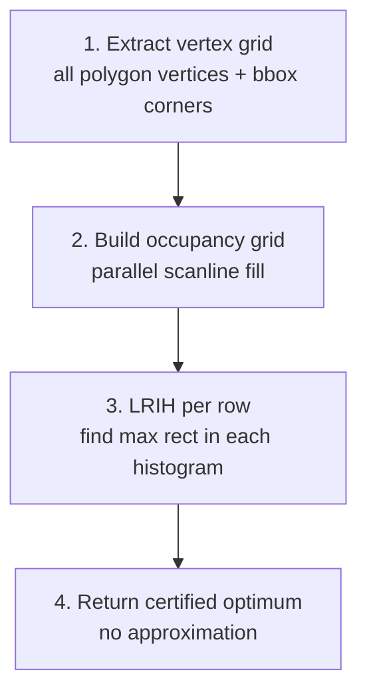

# Axis-Aligned LIR — Exact Vertex-Grid Solver

The axis-aligned solver finds the largest rectangle whose edges are parallel to the coordinate axes. Unlike the oriented solver, this implementation produces a **mathematically certified exact** result — the global optimum, not an approximation.

## Algorithm

Based on Daniels, Milenkovic & Roth (1997): "Finding the largest area axis-aligned rectangle in a polygon."

## Stage 1 — Vertex Grid Construction

All polygon coordinates (exterior ring + all hole rings) are collected. The four bounding box corners are added. The combined list is sorted and deduplicated (tolerance $10^{-12}$) to produce separate $x$ and $y$ coordinate arrays.

If either coordinate array exceeds `max_grid` (default 32), the grid is downsampled to meet the limit.

## Stage 2 — Parallel Occupancy Grid

Same even-odd scanline fill as the oriented solver, but runs in parallel across rows via Rayon. Each row determines which grid cells are inside the polygon.

Time complexity: $O(v + g^2)$ where $v$ = vertices, $g$ = grid size.

## Stage 3 — LRIH Per Row

For each row, the binary occupancy heights form a histogram. LRIH with a monotonic stack finds the maximum-area rectangle in $O(g)$ per row. The global best across all rows is the optimum.

## Why This Is Exact

The method is exact because the rectangle corners are constrained to lie on polygon vertices or bounding box corners. The search space is finite: at most $\binom{g_x}{2} \times \binom{g_y}{2}$ candidate rectangles where $g_x$ and $g_y$ are grid sizes. The algorithm enumerates and evaluates all of them implicitly through LRIH.

No rasterization approximation — the occupancy grid cells correspond exactly to the polygon interior/exterior boundary defined by the scanline fill.

## Options

| Field | Default | Description |
|---|---|---|
| `max_ratio` | 0 (unlimited) | Max width/height ratio |
| `min_ratio` | 0 (unlimited) | Min width/height ratio |