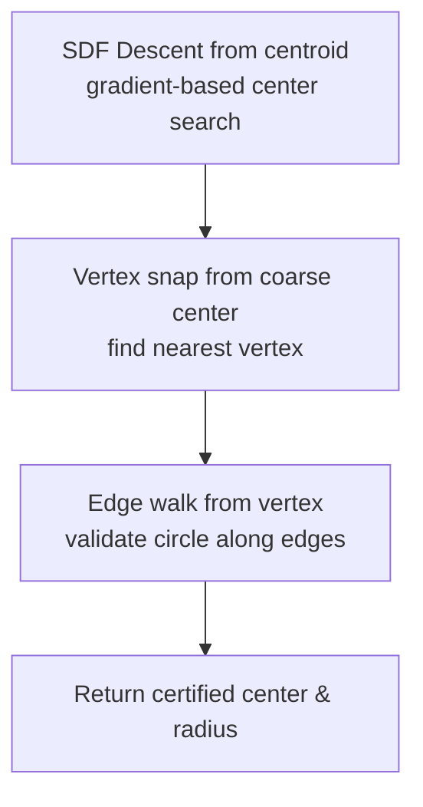

# Maximum Inscribed Circle

Finds the largest circle that fits entirely inside a polygon.

## Algorithm

### Stage 1 — SDF Descent (Coarse)

The polygon SDF (Signed Distance Field) gives the distance from any point to the nearest boundary. Starting from the polygon centroid, a gradient descent runs for up to 1000 iterations (configurable) with tolerance $10^{-6}$. Multiple restarts from random boundary points help escape local maxima.

The SDF is computed via the same `polygon_sdf` used by the oriented LIR expansion — O(v) per evaluation.

### Stage 2 — Vertex Snap (Fine)

From the coarse center, find the nearest polygon vertex. Walk along the incident edges checking whether the circle of current radius stays inside. If any edge violation is found, snap the center slightly inward along the violating edge's normal.

### Stage 3 — Edge Walk

Starting from the vertex-snapped center, walk along each polygon edge. At each vertex, verify that the circle center is at least `radius` distance from the edge. The minimum clearance across all edges and vertices is the certified radius.

### Result Fields

| Field | Description |
|---|---|
| `center_x`, `center_y` | Circle center coordinates |
| `radius` | Certified radius |
| `area` | $\pi r^2$ |

## Notes

The two-sweep design ensures robustness: the coarse SDF descent quickly finds a near-optimal center, while the vertex snap + edge walk provides geometrically precise certification. This mirrors the oriented solver's coarse + fine split, adapted for the circle geometry.