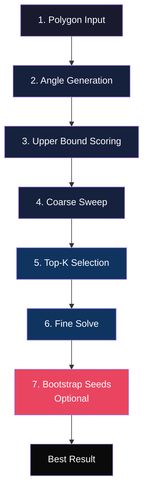
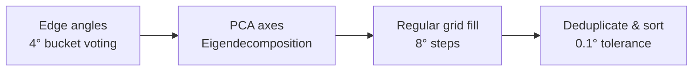
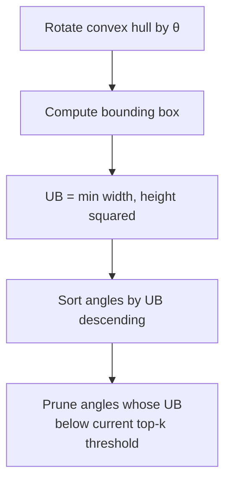
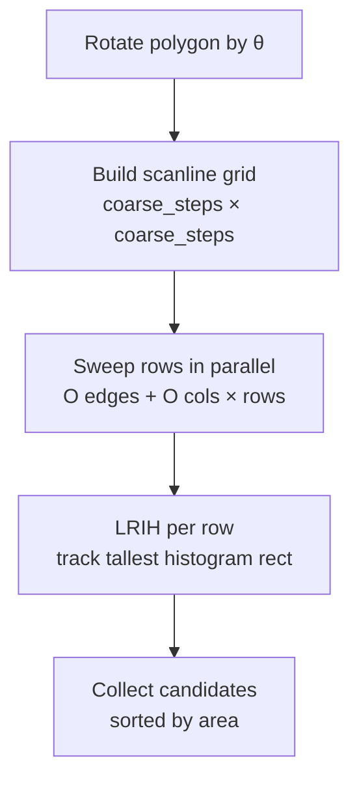
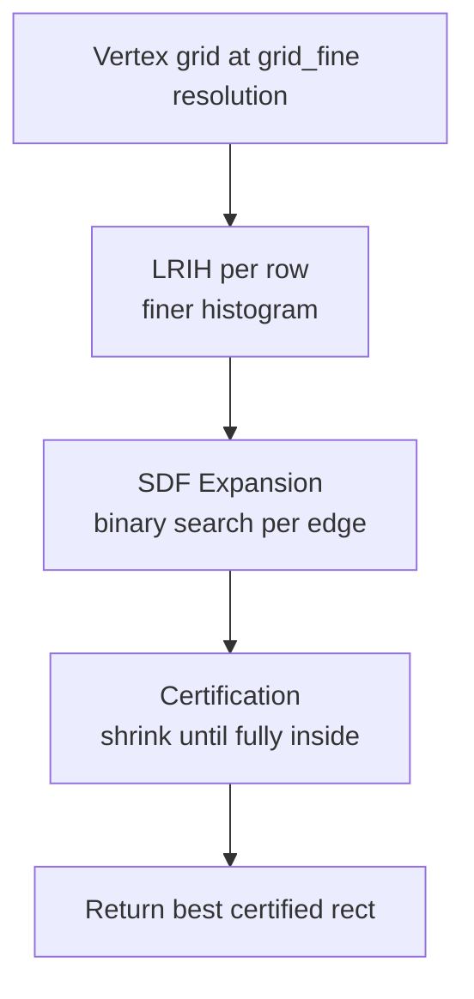
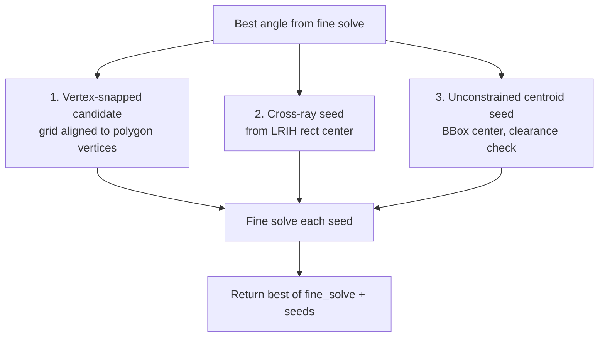

# Oriented LIR — Largest Inscribed Oriented Rectangle

The oriented LIR solver finds the maximum-area rectangle at *any* rotation angle inside an arbitrary polygon. This is the library's primary algorithm, implemented in `crates/ige-core/src/solvers/lir/oriented/`.

## Pipeline Overview

The solver executes six stages in sequence. Each stage refines candidates and updates the best result:



## Stage 1 — Polygon Preparation

`prepare.rs` validates and optionally simplifies the input polygon:

```rust
pub fn prepare_polygon(poly: Polygon<f64>) -> Option<Polygon<f64>>
```

- Rejects polygons with fewer than 3 unique vertices
- Rejects polygons with non-positive signed area
- For polygons with more than 300 vertices, applies Visvalingam-Whyatt simplification at 0.1% of bounding box span to reduce solver load

## Stage 2 — Angle Generation

`candidates.rs` produces the candidate angle set for evaluation:



### Edge-Angle Voting

Each polygon edge contributes its slope angle to a histogram of 91 buckets (0°–90°). Edges longer than a tolerance contribute more heavily. A Gaussian kernel (σ=2 buckets) smooths the histogram. Peaks above a minimum separation (default 4°) become candidate angles.

```rust
pub fn edge_candidate_angles(
    poly: &Polygon<f64>,
    min_sep_deg: f64,  // default 4.0
    max_candidates: usize,  // default 12
) -> Vec<f64>
```

### PCA (Principal Component Analysis)

If `use_pca_axes` is enabled, the covariance matrix of all polygon coordinates is computed:

$$
\mathbf{C} = \begin{pmatrix} \sigma_{xx} & \sigma_{xy} \\ \sigma_{xy} & \sigma_{yy} \end{pmatrix}
$$

Eigenvalues via the quadratic formula:

$$
\lambda = \frac{\text{tr}(\mathbf{C}) \pm \sqrt{\text{tr}(\mathbf{C})^2 - 4\det(\mathbf{C})}}{2}
$$

The dominant eigenvector (largest eigenvalue) points along the polygon's primary elongation axis — a strong candidate angle for the inscribed rectangle.

```rust
pub fn pca_candidate_angles(poly: &Polygon<f64>) -> Vec<f64>
```

### Grid Fill

If fewer than `field_min_angles` (default 45) candidates exist, regular grid angles fill the gap at `field_angle_step` degree intervals (default 5°).

## Stage 3 — Upper Bound Pruning

For each angle, a geometric upper bound on achievable area is computed from the convex hull:



```rust
pub fn upper_bound_area(
    hull: &Polygon<f64>,
    angle_deg: f64,
    max_ratio: f64,
    centroid: Point<f64>,
) -> f64
```

The bounding box of the rotated hull gives $\text{width}(\theta)$ and $\text{height}(\theta)$. The largest possible inscribed rectangle at that angle has area:

$$
\text{UB}(\theta) = \min(w(\theta), h(\theta))^2
$$

Angles are sorted by upper bound descending. During coarse sweep, angles whose UB cannot beat the current $k$-th best area are skipped.

## Stage 4 — Coarse Sweep

The polygon is rotated into the angle's coordinate frame. A parallel scanline raster fills an occupancy grid:



### Mask Building — Even-Odd Fill

`build_mask_parallel` computes the occupancy grid via scanline fill using the even-odd rule. Edges are sorted by their lower y-coordinate. An active edge table is maintained per row, sorted by x-intersection. This is $O(\text{edges} + \text{cols} \times \text{rows})$ — optimal for raster fill.

### LRIH — Largest Rectangle in Histogram

For each row, the occupancy heights form a histogram. LRIH finds the maximum-area rectangle in $O(n)$ using a monotonic stack. The best rectangle across all rows is the coarse candidate.

### Cross-Ray Seeding (Bootstrap Only)

When `use_bootstrap_seeds` is enabled, `coarse_evaluate_angle_with_cross_rays` additionally evaluates cross-ray clearance at the top-5 LRIH centers nearest to the centroid. The cross-ray method casts four cardinal rays from each center and measures clearance to the nearest boundary — producing a geometrically exact rectangle centered at that point.

```rust
fn coarse_evaluate_angle_with_cross_rays(...) -> (Option<Candidate>, Option<Candidate>)
```

Returns both the grid-based LRIH candidate and the best cross-ray candidate. Both enter the top-k pool.

## Stage 5 — Top-K Selection

After coarse sweep across all angles, candidates are sorted by area and the top $k$ (default 20) are forwarded to fine solve. A deduplication pass removes candidates within 2° of each other.

Simulated annealing (`use_simulated_annealing`) adds perturbation candidates from the top-6 seeds before dedup, with a wider 2° dedup tolerance.

## Stage 6 — Fine Solve

The fine solve runs each candidate through a vertex-grid refinement pipeline in parallel:



### Vertex Grid

The polygon is rotated to the candidate's angle. A grid of coordinates is built from all polygon vertices (exterior + holes) plus the bounding box corners. Deduplication and sorting produces the coordinate arrays. If either axis exceeds `field_max_coords` (default 3000), the solver falls back to a uniform grid.

### SDF Expansion

`expand.rs` — Starting from the LRIH rectangle, binary search expands each of the four edges outward until it contacts the polygon boundary. Uses the polygon SDF (Signed Distance Field) to probe interior-exterior status.

The SDF uses Lipschitz skipping: for a vertical probe line, after evaluating SDF at $y_i$, any subsequent $y_j$ within distance $d_i$ of $y_i$ is guaranteed inside if $d_i - |y_j - y_i| > 0$, saving redundant SDF evaluations.

### Certification

`certify.rs` — After expansion, the rectangle is verified fully inside the polygon. The max SDF across 8 sample points (4 corners + 4 edge midpoints) is computed:

$$
s_{\max} = \max_{p \in \text{samples}} \text{SDF}(p)
$$

If $s_{\max} > \epsilon$ (default $10^{-7}$), the rectangle is fully inside. If $s_{\max} < -\epsilon$, the rectangle is shrunk symmetrically from its center by at most `cert_max_shrink` × shorter half-side (default 20%). If certification fails after shrink, the candidate is marked `best_effort = true`.

## Stage 7 — Bootstrap Seeds (Optional)

After fine solve identifies the best angle, three deterministic seed strategies are applied at that angle:



### Vertex-Snapped

A vertex-aligned grid (all polygon vertex coordinates) is built. LRIH finds the best rectangle with corners on vertices. Often matches the exact optimum for near-rectangular polygons.

### Cross-Ray Center

The center of the best LRIH rectangle in the rotated frame is taken, and `candidate_from_cross_rays_rotated` computes the exact clearance rectangle at that center. This is the largest axis-aligned rectangle *centered* at that point.

### Unconstrained Centroid Seed

The centroid of the rotated polygon is taken. Cross-ray clearance is evaluated there. Rejected if minimum clearance is below 1% of diagonal, or if cross-area is below 20% of current best area.

## Options Reference

| Field | Default | Description |
|---|---|---|
| `grid_coarse` | 32 | Scanline resolution for coarse sweep |
| `grid_fine` | 64 | Vertex-grid resolution for fine solve |
| `top_k` | 20 | Candidates forwarded to fine solve |
| `max_ratio` | 0 (unlimited) | Max width/height ratio |
| `min_ratio` | 0 (unlimited) | Min width/height ratio |
| `always_return` | true | Return best-effort if certification fails |
| `use_parallel_field` | false | Polish ±0.75° around best angle |
| `use_simulated_annealing` | false | SA basin escape over top candidates |
| `use_bootstrap_seeds` | false | Vertex-snapped + cross-ray seeds |
| `use_pca_axes` | false | PCA-guided angle candidates |
| `use_edge_anchored` | false | Edge support-derived candidates |
| `polish_halwidth_deg` | 1.0 | Polish search window |
| `cert_eps` | 1e-7 | Certification SDF tolerance |
| `cert_max_shrink` | 0.20 | Max shrink fraction during cert |